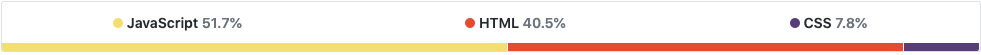

# GifTastic
___

### Design
GifTastic made prominent use of JQuery/Bootstrap and use moderate of CSS for styling individual elements. I linked an external font style sheet for unique styling. An animated background image of television static was formatted to 100% of background and expand with resizing. Then a bootstrap navbar was inserted within a container. The navbar header was styled inline with two television gifs surrounding the text on either day with adjusting of the top margin for proper alignment. Inside of the navbar the instructions are listed and the div displaying buttons renders default buttons populated from an array that calls upon api keys. Outside of the navbar a search form div floats right and contains an input field that stores data values to create new buttons upon submission. Once a button is click, gifs from the corresponding show appear with an image equivalent to their rating by giphy's API displayed as an american television parental guideline rating (TV-G, TV-PG, or TV-14 in place of PG-13).  

### Logic
GifTastic required the use of JavaScript in order to create the game logic. First I declared an array of strings containing 10 show names. 

JQuery was then utilized to display questions to the DOM on associated div with .text. JQuery's append method enabled me to created a radio concatenated with the array index for each question key value function call that displays question text to card deck/DOM by accessing array at a specific index at the question key for question and the answers key with their respective values. Next, an on-click listener was declared that assigns the value of each radio to a variable. Clicking on the submit button causes the setInterval to be cleared and radio value variables are then saved to an array. I then declared a for loop that iterates through answersArr and checks radio value variables against correctAnswersArr at index i, then increments results variable for each correct answer. The function will subsequently display text in results div telling the user how many questions they answered correctly. A function was then created to log correct answers checked in radios if the timer ran down prior to submission by the user. Next an on.click listener attached to the restart button div creates a series of variable reassignments that removes checks from radios, resets timer to original value, and restarts decrement process when game is restarted. 

## Built With

___

* [HTML](https://developer.mozilla.org/en-US/docs/Web/Guide/HTML/HTML5)
* [CSS](https://developer.mozilla.org/en-US/docs/Web/CSS)
* [JavaScript](https://developer.mozilla.org/en-US/docs/Web/JavaScript/Reference)
* [Bootstrap](https://getbootstrap.com/docs/4.3/getting-started/introduction/)
* [JQuery](https://api.jquery.com/)
* [API - GIPHY](https://developers.giphy.com/docs/)
* [AJAX](https://api.jquery.com/category/ajax/)

___

[GifTastic page](https://djgoldstone.github.io/GifTastic/)

___

## Authors

* Derek Goldstone - [UC Berkeley Extension](https://www.linkedin.com/in/derek-goldstone-482884a3/)

___